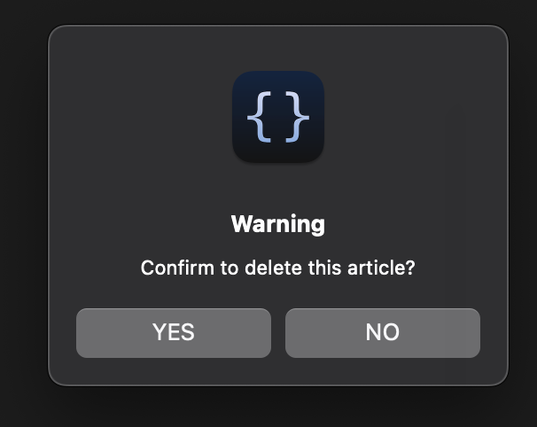
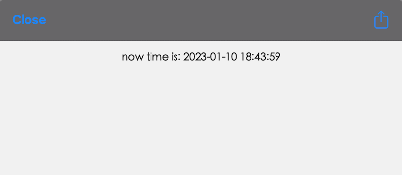

# scripts-for-scriptable

>   Just as its name.

[iOS Scriptable](https://scriptable.app/) | [TestFlight](https://testflight.apple.com/join/uN1vTqxk) | [macOS Scriptable](https://scriptable.app/mac-beta/)

### demo

>   Some component demos.

- [request_demo](demo/request_demo.js)
- [alert_demo](demo/alert_demo.js)
- [dictation_demo](demo/dictation_demo.js)
- [speech_demo](demo/speech_demo.js)
- [location_demo](demo/location_demo.js)
- [message_demo](demo/message_demo.js)
- [keychain_demo](demo/keychain_demo.js)
- [webview_demo](demo/webview_demo.js)

#### screenshot






### module or library

- [spark-md5.min.js](app/spark-md5.min.js)
- [cache.module](app/cache.module.js)
- [http.module](app/http.module.js)

#### usage

```js
// using md5 hash
const sparkMD5 = importModule("spark-md5.min");
let hash = sparkMD5.hash("hi, there")
console.log(hash)

// using cache module
const $cache = importModule("cache.module")

// impl by Keychain
let sCache = $cache.useSecureStorage()
sCache.set("hello", "world")
let sVal = sCache.get("你好")
console.log(sVal)

// impl by FileManager
let fCache = $cache.useFileStorage()
fCache.set("hello", "world")
let fVal = fCache.get("hello")
console.log(fVal)

// using http module
const $http = importModule("http.module")
$http.req('get', 'https://httpbin.org/ip').loadJSON().then(resp => {
    let ip = resp.origin
    console.log(ip);
});
```

### app

- TODO [price_reminder](app/priceReminder.js)

