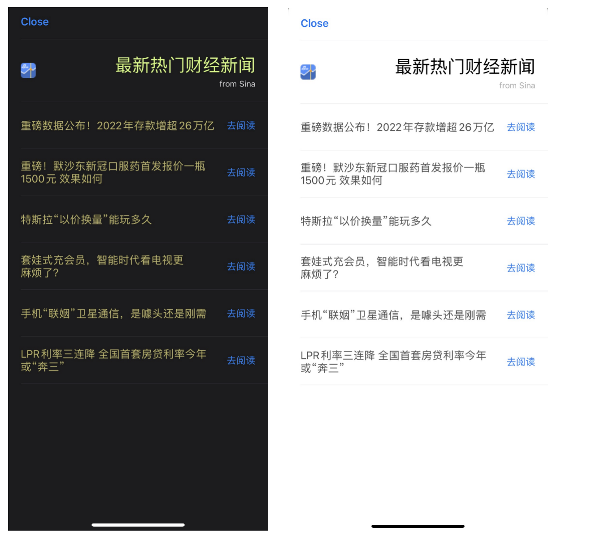
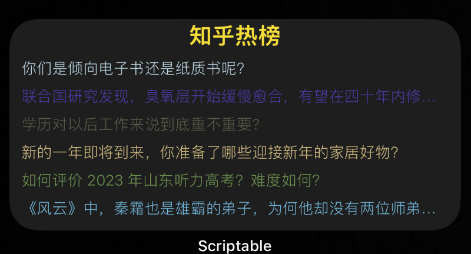
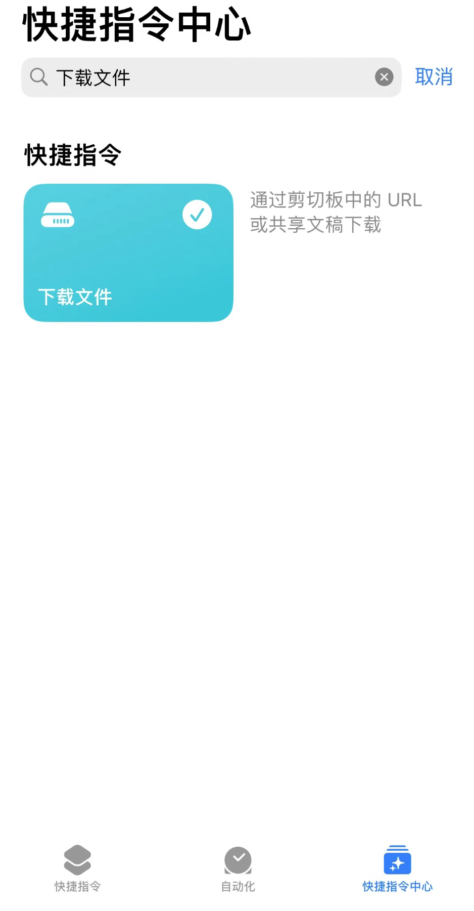

# scripts-for-scriptable

>   Just as its name.

[iOS Scriptable](https://scriptable.app/) | [TestFlight](https://testflight.apple.com/join/uN1vTqxk) | [macOS Scriptable](https://scriptable.app/mac-beta/)

### demo

>   Some component demos.

- [request_demo](demo/request_demo.js)
- [alert_demo](demo/alert_demo.js)
- [dictation_demo](demo/dictation_demo.js)
- [speech_demo](demo/speech_demo.js)
- [location_demo](demo/location_demo.js)
- [message_demo](demo/message_demo.js)
- [keychain_demo](demo/keychain_demo.js)
- [webview_demo](demo/webview_demo.js)
- [uitable_demo](demo/uitable_demo.js) support light and dark appearance
- [widget_demo](demo/widget_demo.js) a widget to show Chinese poetry

#### screenshot





### module or library

- [spark-md5.min.js](app/spark-md5.min.js) code from [js-spark-md5](https://github.com/satazor/js-spark-md5)
- [cache.module](app/cache.module.js)
- [http.module](app/http.module.js)

#### usage

```js
// using md5 hash
const sparkMD5 = importModule("spark-md5.min");
let hash = sparkMD5.hash("hi, there")
console.log(hash)

// using cache module
const $cache = importModule("cache.module")

// impl by Keychain
// note: you can pass prefix string to isolate different app
let sCache = $cache.useSecureStorage('prefixForApp1')
sCache.set("hello", "world")
let sVal = sCache.get("hello")
console.log(sVal)

// impl by FileManager
// note: you can pass prefix string to isolate different app
let fCache = $cache.useFileStorage('prefixForApp2')
fCache.set("hello", "world")
let fVal = fCache.get("hello")
console.log(fVal)

// using http module
const $http = importModule("http.module")
$http.req('get', 'https://httpbin.org/ip').loadJSON().then(resp => {
    let ip = resp.origin
    console.log(ip);
});
```

### app

| 名称 | 中文名称 | 说明或备注 |
| --------------------------- | ---------- | ------------------------- |
| [zhihuHot](app/zhihuHot.js) | 知乎热点 | 展示知乎热点数据，50条结果中随机 |
| [priceReminder](app/priceReminder.js) | 贵金属价格提示器 | 展示现货黄金/白银价格 |
| [acgGirl](app/acgGirl.js) | 二次元妹子 | 各种二次元妹子，支持多种来源提供者 |
| [dogDiary](app/dogDiary.js) | 舔狗日记 | 舔到最后，一无所有 |
| [videoHelper](app/videoHelper.js) | 视频助手 | 支持头条系视频下载 |


#### zhihuHot

>   展示知乎热点，建议提前安装好知乎 App，以方便点击跳转，源代码 [zhihuHot](app/zhihuHot.js)，依赖同目录下 `http.module` 与 `cache.module` 模块。

预览图如下：



#### priceReminder

>   贵金属价格提示器，展示 `XAUUSD/XAGUSD/Au(T+D)/Ag(T+D)` 等价格，数据来源新浪财经，由于 widget 机制，价格刷新不及时。

预览图如下：


#### acgGirl

>   展示各种二次元妹子，支持多种提供者来源，在 `widget` 配置中，可以填写下列任一个提供者 `provider` 。

```
hanxiaohan
xjh
yimian
yiluo
ouklc
btstu
r10086
ixiaowai
```

预览图如下：


#### dogDiary

>   舔狗日记（语录），舔狗数据来源 [we.dog](https://github.com/xiongbao/we.dog) ，内置到脚本中，没有对接定位与天气接口，天气类型随机处理（支持 widget 参数传入）。

预览图如下：


#### videoHelper

>   视频助手，解析接口来自 [星辰API](https://api.xcboke.cn/doc/juhe.html) ，文档中说支持“抖音/快手/火山/微博/虎牙/轻视频/梨视频/皮皮虾/皮皮搞笑/微视/最右/VUE Vlog/新片场/度小视/六间房/acfun”，目前仅自测抖音，其它平台请自测。

需要搭配苹果官方 “快捷指令” 与 “文件” App使用，请在快捷指令中搜索并安装 “文件下载” 指令。



“文件下载” 指令是保存到 `iCloud` 云盘；如果需要下载保存到本地相簿，可以在手机中打开 [此链接](https://www.icloud.com/shortcuts/8e4fd6da777e418498237e00621b969f) 或者扫描下面二维码安装 “DownloadVideo” 脚本，然后自行脚本代码，将 `cb.addParameter("name", "下载文件")` 修改为 `cb.addParameter("name", "DownloadVideo")` 即可。


使用时，请复制各短视频APP分享地址然后到 `Scriptable` 应用执行此脚本（通过剪切板方式）；或者应用中分享拉到最右“更多分享”，选择 `Run Script` 选定 `VideoHelper` 脚本（如果未出现，请检查一下是否存在设置过 `Share Sheet Inputs` 且选择 `Text` 以及开启 `Always Run in App`，见下图）。如果出现是获取剪切板权限以及链接到网络请保持允许，否则可能解析下载失败。


快捷使用起见，你也可以添加此脚本到手机桌面，操作流程大致如下：


