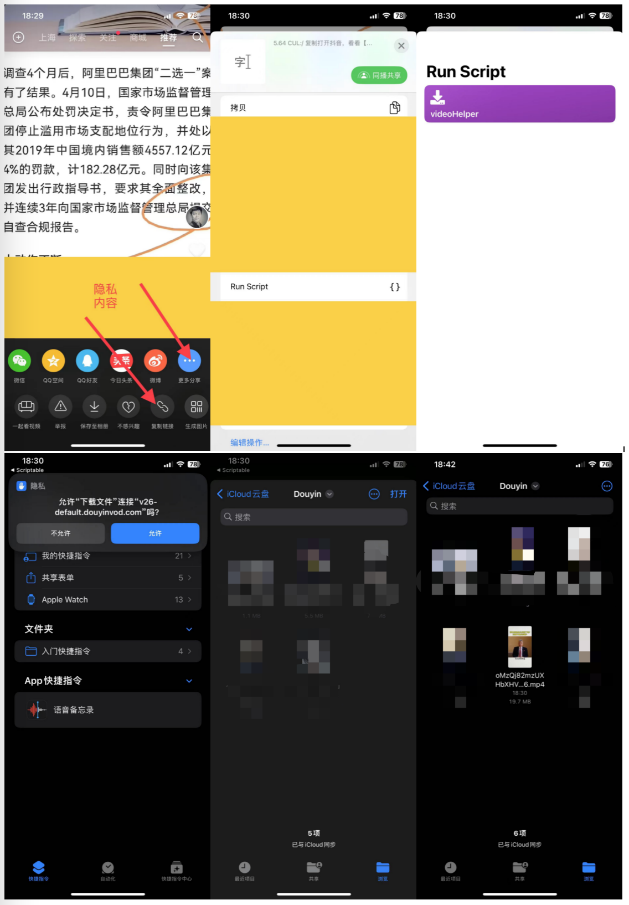

# scripts-for-scriptable

>   Just as its name.

[iOS Scriptable](https://scriptable.app/) | [TestFlight](https://testflight.apple.com/join/uN1vTqxk) | [macOS Scriptable](https://scriptable.app/mac-beta/)

### 应用商店


扫描上面快捷指令二维码运行或者手动导入 [rStore](app/rStore.js) 脚本或者到 `Scriptable` 中，后续即可快捷安装更新本人出品的应用。如脚本能起到增效或娱乐作用，请 `Star` 支持，谢谢！

应用商店截图：


### demo

>   Some component demos.

- [request_demo](demo/request_demo.js)
- [alert_demo](demo/alert_demo.js), see [screenshot](screenshot/alert_demo.png)
- [dictation_demo](demo/dictation_demo.js)
- [speech_demo](demo/speech_demo.js)
- [location_demo](demo/location_demo.js)
- [message_demo](demo/message_demo.js)
- [keychain_demo](demo/keychain_demo.js)
- [webview_demo](demo/webview_demo.js), see [screenshot](screenshot/webview_demo.png)
- [uitable_demo](demo/uitable_demo.js) support light and dark appearance, see [screenshot](screenshot/uitable_demo.png)
- [widget_demo](demo/widget_demo.js) a widget to show Chinese poetry, see [screenshot](screenshot/widget_demo.png)

### module or library

- [spark-md5.min.js](app/spark-md5.min.js) code from [js-spark-md5](https://github.com/satazor/js-spark-md5)
- [cache.module](app/cache.module.js)
- [http.module](app/http.module.js)

#### usage

```js
// using md5 hash
const sparkMD5 = importModule("spark-md5.min");
let hash = sparkMD5.hash("hi, there")
console.log(hash)

// using cache module
const $cache = importModule("cache.module")

// impl by Keychain
// note: you can pass prefix string to isolate different app
let sCache = $cache.useSecureStorage('prefixForApp1')
sCache.set("hello", "world")
let sVal = sCache.get("hello")
console.log(sVal)

// impl by FileManager
// note: you can pass prefix string to isolate different app
let fCache = $cache.useFileStorage('prefixForApp2')
fCache.set("hello", "world")
let fVal = fCache.get("hello")
console.log(fVal)

// using http module
const $http = importModule("http.module")
$http.req('get', 'https://httpbin.org/ip').loadJSON().then(resp => {
    let ip = resp.origin
    console.log(ip);
});
```

### app

>   除非特别说明，所有脚本同样也支持 `Scriptable` 电脑版，下面是 `macOS` 下的通知栏小组件预览图：


| 名称 | 中文名称 | 说明或备注 |
| --------------------------- | ---------- | ------------------------- |
| [IPTV](app/IPTV.js) 🆕 ❌（已失效不可用）| 网络电视 | 手机在线看电视 |
| [zhihuHot](app/zhihuHot.js) | 知乎热点 | 展示知乎热点数据，50条结果中随机 |
| [priceReminder](app/priceReminder.js) | 贵金属价格提示器 | 展示现货黄金/白银价格 |
| [acgGirl](app/acgGirl.js) | 二次元妹子 | 各种二次元妹子，支持多种来源提供者 |
| [dogDiary](app/dogDiary.js) | 舔狗日记 | 舔到最后，一无所有 |
| [videoHelper](app/videoHelper.js) ❌（API解析已失效，改为打开第三方网站） | 视频助手 | 支持头条系等应用短视频下载 |
| [acgPPT](app/acgPPT.js) | 动漫游PPT | 动态切换动漫游主题图片 |
| [todayHistory](app/todayHistory.js) | 历史上的今天 | 展示历史上的今天旧闻 |
| [showPhoto](app/showPhoto.js) | 秀相册 | 展示本地相册图片 |
| [iLottery](app/iLottery.js) | 爱彩票 | 展示彩票开奖结果 |

### IPTV 🆕

>   无须借助第三方，直接在 iPhone 手机上看电视，默认使用 [fanmingming ipv6](https://github.com/fanmingming/live/blob/main/tv/m3u/ipv6.m3u) 源文件，IPv6 网络下使用最佳。

预览图如下：


#### zhihuHot

>   展示知乎热点，建议提前安装好知乎 App，以方便点击跳转，源代码 [zhihuHot](app/zhihuHot.js)，依赖同目录下 `http.module` 与 `cache.module` 模块。

预览图如下：


#### priceReminder

>   贵金属价格提示器，展示 `XAUUSD/XAGUSD/Au(T+D)/Ag(T+D)` 等价格，数据来源新浪财经，由于 widget 机制，价格刷新不及时。

预览图如下：


#### acgGirl

>   展示各种二次元妹子，支持多种提供者来源，在 `widget` 配置中，可以填写下列任一个提供者 `provider` 。
>   *特别注意*：部分 `provider` 网站可能已失效无法访问，请以最新代码为准。

```
hanxiaohan
xjh
yimian
yiluo
btstu
r10086
```

预览图如下：


#### dogDiary

>   舔狗日记（语录），舔狗数据来源 [we.dog](https://github.com/xiongbao/we.dog) ，内置到脚本中，没有对接定位与天气接口，天气类型随机处理（支持 widget 参数传入）。

预览图如下：


#### videoHelper

>   视频助手，解析接口来自[TikDD](https://www.tikdd.cc/zh-Hans/)，仅支持抖音与 `TikTok`。已过时或失效API： <del>[星辰API](https://api.xcboke.cn/doc/juhe.html)</del> <del>[猪猪API](https://api.iculture.cc/)</del>， 文档中说支持“抖音/快手/火山/微博/虎牙/轻视频/梨视频/皮皮虾/皮皮搞笑/微视/最右/VUE Vlog/新片场/度小视/六间房/acfun”，目前仅测试过抖音，其它平台请自测。

需要搭配苹果官方 “快捷指令” 与 “文件” App使用，请在快捷指令中搜索并安装 “文件下载” 指令。


“文件下载” 指令是保存到 `iCloud` 云盘；如果需要下载保存到本地相簿，可以在手机中打开 [此链接](https://www.icloud.com/shortcuts/8e4fd6da777e418498237e00621b969f) 或者扫描下面二维码安装 “DownloadVideo” 快捷指令，然后再自行修改 [videoHelper.js](app/videoHelper.js) 脚本代码，将 `cb.addParameter("name", "下载文件")` 修改为 `cb.addParameter("name", "DownloadVideo")` 即可。


使用时，请复制各短视频APP分享地址然后到 `Scriptable` 应用执行此脚本（通过剪切板方式）；或者应用中分享拉到最右“更多分享”，选择 `Run Script` 选定 `VideoHelper` 脚本（如果未出现，请检查一下是否存在设置过 `Share Sheet Inputs` 且选择 `Text` 以及开启 `Always Run in App`，见下图）。如果出现获取剪切板权限以及链接到网络等选项请保持允许，否则可能解析下载失败。




快捷使用起见，你也可以添加此脚本到手机桌面，操作流程大致如下：


#### acgPPT

顾名思义，可以动态切换的动漫游图片集，由 `r10086.com` 提供，注意该网站为原作者使用 `frp` 内穿构建的，可能存在不稳定性。点此查看 [原始网站](https://img.r10086.com/) 说明。


#### todayHistory

历史上的今天，以榜单形式展示，数据来源 [tool.lu](https://tool.lu/todayonhistory/) ，点击条目之后可以跳转到百度移动版搜索旧闻。


#### showPhoto

不同于 `acgGirl` 脚本从网络下载图，`showPhoto` 从本地相册中选图（更加安全可控，可用于展示一些纪念性的图片如结婚照等），然后保存到缓存中，当应用到手机桌面 `widget` 时， 将直接使用缓存中的图片数据。


#### iLottery

展示中国彩票双色球与大乐透开奖结果，开奖数据来源 [500彩票网](https://500.com/) ，可能存在不及时情况。脚本默认展示大乐透（`dlt`），可在 widget 配置中传入双色球汉语拼音缩写（`ssq`）切换成双色球结果。

特别提醒：双色球每周二、四、日开奖；大乐透每周一、三、六开奖。

